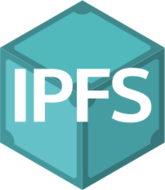
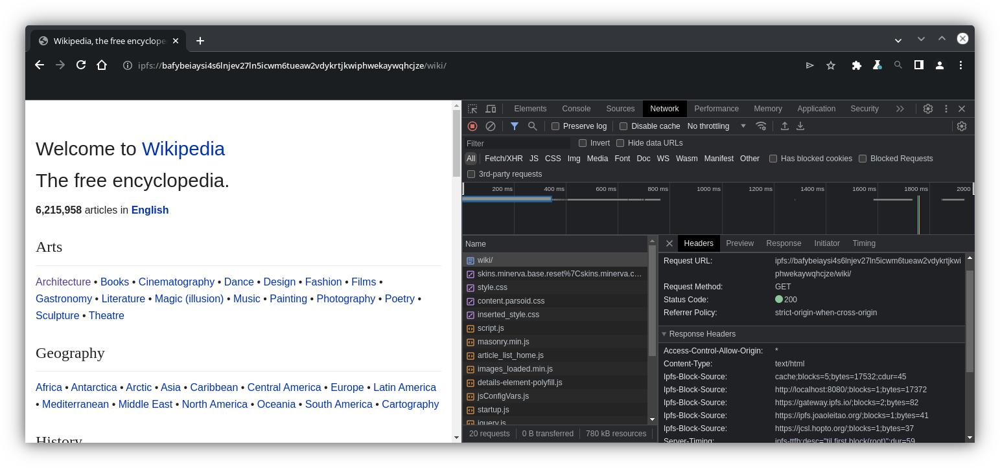

<!--
theme: default
headingDivider: 3
style: |
  section {
    background-color: #CDEFFF;
    --color-canvas-subtle: #a9a9a9;
  }
  th {
    background-color: #CDEFFF;
  }
  th:empty {
    visibility: hidden;
  }
  img {
    display: block;
    margin-left: auto;
    margin-right: auto;
  }
  h1 {
    text-align: center;
  }
  h2 {
    text-align: center;
  }
  h3 {
    text-align: left;
  }
--> 

# Verifying IPFS Client in Chromium

<table style="margin-left:auto;margin-right:auto;">
<tr >
<td colspan="2">

</td><td colspan="2">

 
</td></tr>

<tr>
<td>

</td><td>

</td><td>

</td><td>

</tr></table>

## What is IPFS?

Content-addressed distributed storage.

Relevant URL types:

* ipfs://bafybeidjtwun7gvpfjymhquloxzzwhpctgsw3vxampxr46du2we4yhiqje/reference/en/index.html
  - Refers to immutable content/site
  - Verifiable through hash
* ipns://k51qzi5uqu5dijv526o4z2z10ejylnel0bfvrtw53itcmsecffo8yf0zb4g9gi/links.html
  - Mutable pointer to immutable data
  - Verifiable through key signing
* ipns://en.wikipedia-on-ipfs.org/wiki/Book
  - DNSLink uses DNS TXT records to redirect to /ipns/ or /ipfs/

## CID Magic

A Content ID (CID) is based on a hash, and therefore its content is immutable & verifiable.

Example:
#### f015512206da6d67e9c8adc3752c8188c1adb52ee6fb1755816a8b1dc707b02a85a27ab09
* f  - This string representation is base-16
* 01 - Conforms to CID version 1
* 55 - Codec of content (raw in this case) 
* 12 - The hash is sha2-256
* 20 - The hash digest is 32 bytes long
* 6da6d67e9c8adc3752c8188c1adb52ee6fb1755816a8b1dc707b02a85a27ab09 - hash digest

## IPNS Name

Same format as CIDs, but refers to a public key.

Example:
#### f0172002408011220e325f1b1b61029ac55c1dcd8a23949f53dc99131eaf424f341478eabc08233bc
* 72 - Codec is "libp2p-key"
* 00 - Hash type is "identity" (data itself here, not hashed)
* 08011220e325f1b1b61029ac55c1dcd8a23949f53dc99131eaf424f341478eabc08233bc - Public key

## IPNS Record

All you need to verify what that name currently points at, in a protobuf.
Including:
* A signature
* CBOR object that was signed
  - Value: What the name points at, starting with /ipfs/ or /ipns/
  - Sequence: Serial # for multiple records signed by the same key (highest wins)
  - Validity: An expiration date, essentially
* Other fields omitted for simplicity

## Origin

http:'s origin is about host & port - essentially 'where' to find content.

Since all the content is verifiable, it can be pieced together from various/any sources.

* ipfs:
  - Answers 'what' data to find
  - The origin includes CID and therefore hash, with which to verify.
* ipns:
  - Answers 'whose' data to find
  - The origin includes pubkey
  - Gateway provides the verifiable record, reducing to previous problem
* DNSLink
  - Origin includes a hostname (Assume DNS TXT is reliable)
  - TXT record lookup reduces to earlier problem

## Prior art

* Manually using a particular gateway
* IPFS Companion (extension)
  - Similar to above, but much less manual.
* Brave
  - Integrated into UI
  - User's choice: 
    - pick 1 gateway to use
    - have Brave download software & run an IPFS node

## Let's step through loading a page

### User enters URL
ipns://k51qzi5uqu5dku8zqce3b7kmpcw6uua9w00b5boyaevowmzls2rpie0itokett/

flowchart LR;
    ipns["/ipns/k51qzi5uqu5dku8zqce3b7kmpcw6uua9w00b5boyaevowmzls2rpie0itokett"]
    style ipns fill:#f9f

### Request IPNS Record
http://localhost:8080/ipns/k51qzi5uqu5dku8zqce3b7kmpcw6uua9w00b5boyaevowmzls2rpie0itokett?format=ipns-record
Record points at a DNSLink!

flowchart LR;
    ipns["/ipns/k51...ett"]-->dnsl["/ipns/ipfs.tech"]
    style ipns fill:#f9f
    style dnsl fill:#fa9

 

### DNS TXT Record Lookup
_dnslink.ipfs.tech has TXT "dnslink=/ipfs/QmRE3dyFsbhC1dAthPBvgo4w15dGwppCAybgmJDB5m2SRy"

flowchart LR;
    ipns["/ipns/k51...ett"]-->dnsl["/ipns/ipfs.tech"]-->root["/ipfs/QmR...2SRy"]
    style ipns fill:#f9f
    style dnsl fill:#fa9

### We have our immutable content
Request root node.
https://ipfs.io/ipfs/QmRE3dyFsbhC1dAthPBvgo4w15dGwppCAybgmJDB5m2SRy?format=raw

flowchart LR;
    ipns["/ipns/k51...ett"]-->dnsl["/ipns/ipfs.tech"]-->root["/ipfs/QmR...2SRy"]
    style ipns fill:#f9f
    style dnsl fill:#fa9
    root-->e1["..."]
    root-->nuxt["_nuxt = QmYpxEzdbNbohung4gQoZFoQEzLNeBT8oGCQGPtKgjDbnT"]
    root-->e3["..."]
    root-->index["index.html = QmTzVjzGMG4LwBY9ArxcNcokPfbpG2biT8Gy9AiecxKtju"]
    root-->e5["..."]
    style root fill:#9fb

### It's a directory that contains index.html, so request that
https://gateway.pinata.cloud/ipfs/QmTzVjzGMG4LwBY9ArxcNcokPfbpG2biT8Gy9AiecxKtju?format=raw
Note the recursive verification.

flowchart LR;
    ipns["/ipns/k51...ett"]-->dnsl["/ipns/ipfs.tech"]-->root["/ipfs/QmR...2SRy"]
    style ipns fill:#f9f
    style dnsl fill:#fa9
    root-->e1["..."]
    root-->nuxt["_nuxt = QmYpxEzdbNbohung4gQoZFoQEzLNeBT8oGCQGPtKgjDbnT"]
    root-->e3["..."]
    root-->index["index.html = QmTzVjzGMG4LwBY9ArxcNcokPfbpG2biT8Gy9AiecxKtju"]
    root-->e5["..."]
    style root fill:#9fb
    style index fill:#9fb

### index.html fits into a single node
So just deserialize and return its content! 
The HTML starts rendering, and requests a resource.
``
This is relative to the ipns root, so start over with a request for:
`ipns://k51qzi5uqu5dku8zqce3b7kmpcw6uua9w00b5boyaevowmzls2rpie0itokett/_nuxt/ipfs-logo.a313bcee.svg`

### Lots of stuff is in hot in cache. Requesting the entry _nuxt:
https://ipfs.joaoleitao.org/QmYpxEzdbNbohung4gQoZFoQEzLNeBT8oGCQGPtKgjDbnT?format=raw

flowchart LR;
    ipns["/ipns/k51...ett"]-->dnsl["/ipns/ipfs.tech"]-->root["/ipfs/QmR...2SRy"]
    style ipns fill:#f9f
    style dnsl fill:#fa9
    root["/ipfs/QmR...SRy"]
    root-->e1["..."]
    root-->nuxt["_nuxt = QmY...bnT"]
    root-->e3["..."]
    root-->index["index.html = QmT...tju"]
    root-->e5["..."]
    style root fill:#9fb
    style index fill:#9fb

### _nuxt is also a directory, with 164 entries
Request the file we're after.
https://ipfs.fleek.co/ipfs/QmWTW21hadJGoAcmGZC18mCFq71UUVGPtJSX5PeBubnQCQ?format=raw

flowchart LR;
    ipns["/ipns/k51...ett"]-->dnsl["/ipns/ipfs.tech"]-->root["/ipfs/QmR...2SRy"]
    style ipns fill:#f9f
    style dnsl fill:#fa9
    root["/ipfs/QmR...SRy"]
    root-->e1["..."]
    root-->nuxt["_nuxt = QmY...bnT"]
    root-->e3["..."]
    root-->index["index.html = QmT...tju"]
    root-->e5["..."]
    nuxt-->f0["..."]
    nuxt-->img["ipfs-logo.a313bcee.svg = QmWTW21hadJGoAcmGZC18mCFq71UUVGPtJSX5PeBubnQCQ"]
    nuxt-->f1["..."]
    style root fill:#9fb
    style index fill:#9fb
    style nuxt fill:#9fb

### If this file were big
Request the file parts in parallel
https://gateway.ipfs.io/ipfs/Qm...1
https://jcsl.hopto.org/ipfs/Qm...2

flowchart LR;
    ipns["/ipns/k51...ett"]-->dnsl["/ipns/ipfs.tech"]-->root["/ipfs/QmR...2SRy"]
    style ipns fill:#f9f
    style dnsl fill:#fa9
    root["/ipfs/QmR...SRy"]
    root-->e1["..."]
    root-->nuxt["_nuxt = QmY...bnT"]
    root-->e3["..."]
    root-->index["index.html = QmT...tju"]
    root-->e5["..."]
    nuxt-->f1["..."]
    nuxt-->img["ipfs-logo.a313bcee.svg = QmWTW21hadJGoAcmGZC18mCFq71UUVGPtJSX5PeBubnQCQ"]
    nuxt-->f2["..."]
    style root fill:#9fb
    style index fill:#9fb
    style nuxt fill:#9fb
    style img fill:#9fb
    img-->c0["Qm...1"]
    img-->c1["Qm...2"]

## Since the HTTP response can come from any source...

Make the same request to multiple gateways in parallel. 
One will return first, others are cancelled. 
Reduces worst-case times. 

e.g.:

- https://ipfs.io/ipfs/QmRE3dyFsbhC1dAthPBvgo4w15dGwppCAybgmJDB5m2SRy?format=raw
- https://dweb.link/ipfs/QmRE3dyFsbhC1dAthPBvgo4w15dGwppCAybgmJDB5m2SRy?format=raw
- https://jorropo.net/ipfs/QmRE3dyFsbhC1dAthPBvgo4w15dGwppCAybgmJDB5m2SRy?format=raw

## Possible future considerations

* Design & implementation changes necessary for upstreaming
* IPFS V1 HTTP Routing API - Helping with missing data and exhausted known gateways
* Partial CAR requests - fewer network round-trips
* IPFS-specific DevTools (e.g.: DAG explorer)
* Possibly connecting to webtransport IPFS peers

## POC Screenshot

## Questions & Contact/Further reading

| what                 | where                                                         |
|----------------------|---------------------------------------------------------------|
| ChromeStatus Feature | https://chromestatus.com/feature/5105580464668672             |
| Tracking Issue       | https://bugs.chromium.org/p/chromium/issues/detail?id=1440503 |
| POC Repo             | https://github.com/little-bear-labs/ipfs-chromium             |
| John's Email         | john@littlebearlabs.io                                        |
| IPFS Specs           | https://specs.ipfs.tech                                       |

