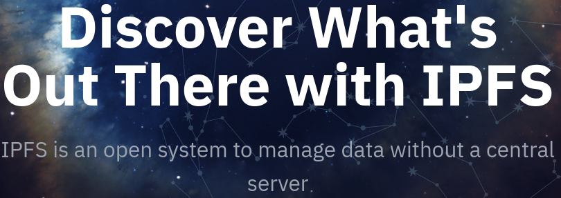

<!--
theme: default
headingDivider: 3
style: |
  section {
    background-color: #CDEFFF;
    --color-canvas-subtle: #a9a9a9;
  }
  th {
    background-color: #CDEFFF;
  }
  th:empty {
    visibility: hidden;
  }
  img {
    display: block;
    margin-left: auto;
    margin-right: auto;
  }
  h1 {
    text-align: center;
  }
  h2 {
    text-align: center;
  }
  h3 {
    text-align: left;
  }
--> 

# Content-Verifying IPFS Client in Chromium

<table style="margin-left:auto;margin-right:auto;">
<tr >
<td colspan="2">


</td><td colspan="2">

 
</td></tr>

<tr>
<td>


</td><td>


</td><td>


</td><td>


</tr></table>

## What is IPFS?
* Content-addressed: pulling from a DHT & verifying
* Distributed: agnostic to which gateway/node provided

<table border="0"><tr><td style="background-color: #DFDAFF; font-size: 15px;">

#### Some of the IPFS Ecosystem
- Brave 
- IPFS Companion extension
- curl 
- js-ipfs-core
- kubo
- lassie
- bifrost
</td><td style="background-color: #DFDAFF">



</td></tr></table>

## URL Schemes

* ipfs://bafybeidjtwun7gvpfjymhquloxzzwhpctgsw3vxampxr46du2we4yhiqje/reference/en/index.html
  - Refers to immutable content/site
  - Origin contains hash for root of Merkle tree
* ipns://k51qzi5uqu5dijv526o4z2z10ejylnel0bfvrtw53itcmsecffo8yf0zb4g9gi/links.html
  - Mutable pointer to immutable data
  - Origin contains public key to verify the 'pointer' record
* ipns://en.wikipedia-on-ipfs.org/wiki/Book
  - DNSLink uses DNS TXT records to redirect to /ipns/ or /ipfs/
  - Origin contains hostname

## Let's step through loading a page
<script type="module">
  import mermaid from 'https://cdn.jsdelivr.net/npm/mermaid@10/dist/mermaid.esm.min.mjs';
  mermaid.initialize({ startOnLoad: true });
</script>

### User enters URL
ipns://k51qzi5uqu5dku8zqce3b7kmpcw6uua9w00b5boyaevowmzls2rpie0itokett/
<div class="mermaid">
flowchart LR;
    ipns["/ipns/k51qzi5uqu5dku8zqce3b7kmpcw6uua9w00b5boyaevowmzls2rpie0itokett"]
    style ipns fill:#f9f
</div>

### Request IPNS Record
http://localhost:8080/ipns/k51qzi5uqu5dku8zqce3b7kmpcw6uua9w00b5boyaevowmzls2rpie0itokett?format=ipns-record
Returns: `Content-Type: application/vnd.ipfs.ipns-record`
Body (protobuf) contains:
```
Value:         "/ipns/ipfs.tech"
... snip ...
Signature V2:  "mKWg7Jv/T+7hhKE1d/9YY7JHWeAaBJ/yQI3C56xn5v7ld9MZO2InUIGE0vSpW+ZRw3nNMJJT+usye8Tt2GRqpCw"
Data:          {"Sequence":0,"TTL":60000000000,"Validity":{"/":{"bytes":"MjAyMy0wOS0yOFQxMzo0MDoyMS4xMzI1NDQwMDFa"}},"ValidityType":0,"Value":{"/":{"bytes":"L2lwbnMvaXBmcy50ZWNo"}}}
```
Verify signature and continue.
<div class="mermaid">
flowchart LR;
    ipns["/ipns/k51...ett"]-->dnsl["/ipns/ipfs.tech"]
    style ipns fill:#f9f
    style dnsl fill:#fa9
</div> 

### DNS TXT Record Lookup
_dnslink.ipfs.tech has TXT "dnslink=/ipfs/QmRE3dyFsbhC1dAthPBvgo4w15dGwppCAybgmJDB5m2SRy"
<div class="mermaid">
flowchart LR;
    ipns["/ipns/k51...ett"]-->dnsl["/ipns/ipfs.tech"]-->root["/ipfs/QmR...2SRy"]
    style ipns fill:#f9f
    style dnsl fill:#fa9
</div>

### We have our immutable content
Request the root node in a verifiable format 
(see https://specs.ipfs.tech/http-gateways/trustless-gateway/)

https://ipfs.io/ipfs/QmRE3dyFsbhC1dAthPBvgo4w15dGwppCAybgmJDB5m2SRy?format=raw
Returns `Content-Type: application/vnd.ipld.raw` directory with 26 entries.
Verify the hash matches and continue.
<div class="mermaid">
flowchart LR;
    ipns["/ipns/k51...ett"]-->dnsl["/ipns/ipfs.tech"]-->root["/ipfs/QmR...2SRy"]
    style ipns fill:#f9f
    style dnsl fill:#fa9
    root-->e1["..."]
    root-->nuxt["_nuxt = QmYpxEzdbNbohung4gQoZFoQEzLNeBT8oGCQGPtKgjDbnT"]
    root-->e3["..."]
    root-->index["index.html = QmTzVjzGMG4LwBY9ArxcNcokPfbpG2biT8Gy9AiecxKtju"]
    root-->e5["..."]
    style root fill:#9fb
</div>

### The directory that contains index.html, so request that
https://gateway.pinata.cloud/ipfs/QmTzVjzGMG4LwBY9ArxcNcokPfbpG2biT8Gy9AiecxKtju?format=raw
Or set header `Accept: application/vnd.ipld.raw` instead of format parameter.
Note the recursive verification.
<div class="mermaid">
flowchart LR;
    ipns["/ipns/k51...ett"]-->dnsl["/ipns/ipfs.tech"]-->root["/ipfs/QmR...2SRy"]
    style ipns fill:#f9f
    style dnsl fill:#fa9
    root-->e1["..."]
    root-->nuxt["_nuxt = QmYpxEzdbNbohung4gQoZFoQEzLNeBT8oGCQGPtKgjDbnT"]
    root-->e3["..."]
    root-->index["index.html = QmTzVjzGMG4LwBY9ArxcNcokPfbpG2biT8Gy9AiecxKtju"]
    root-->e5["..."]
    style root fill:#9fb
    style index fill:#9fb
</div>

### index.html fits into a single block
So just deserialize and return its content. 
The HTML starts rendering, and requests a resource.
``
This is relative to the ipns root, so start over with a request for:
`ipns://k51qzi5uqu5dku8zqce3b7kmpcw6uua9w00b5boyaevowmzls2rpie0itokett/_nuxt/ipfs-logo.a313bcee.svg`

### Lots of stuff is in hot in cache. Requesting the entry _nuxt:
https://ipfs.joaoleitao.org/QmYpxEzdbNbohung4gQoZFoQEzLNeBT8oGCQGPtKgjDbnT?format=raw
<div class="mermaid">
flowchart LR;
    ipns["/ipns/k51...ett"]-->dnsl["/ipns/ipfs.tech"]-->root["/ipfs/QmR...2SRy"]
    style ipns fill:#f9f
    style dnsl fill:#fa9
    root["/ipfs/QmR...SRy"]
    root-->e1["..."]
    root-->nuxt["_nuxt = QmY...bnT"]
    root-->e3["..."]
    root-->index["index.html = QmT...tju"]
    root-->e5["..."]
    style root fill:#9fb
    style index fill:#9fb
</div>

### _nuxt is also a directory, with 164 entries
Request the file we're after.
https://ipfs.fleek.co/ipfs/QmWTW21hadJGoAcmGZC18mCFq71UUVGPtJSX5PeBubnQCQ?format=raw
<div class="mermaid">
flowchart LR;
    ipns["/ipns/k51...ett"]-->dnsl["/ipns/ipfs.tech"]-->root["/ipfs/QmR...2SRy"]
    style ipns fill:#f9f
    style dnsl fill:#fa9
    root["/ipfs/QmR...SRy"]
    root-->e1["..."]
    root-->nuxt["_nuxt = QmY...bnT"]
    root-->e3["..."]
    root-->index["index.html = QmT...tju"]
    root-->e5["..."]
    nuxt-->f0["..."]
    nuxt-->img["ipfs-logo.a313bcee.svg = QmWTW21hadJGoAcmGZC18mCFq71UUVGPtJSX5PeBubnQCQ"]
    nuxt-->f1["..."]
    style root fill:#9fb
    style index fill:#9fb
    style nuxt fill:#9fb
</div>

### If this file were big
Request the file parts in parallel
https://gateway.ipfs.io/ipfs/Qm...1
https://jcsl.hopto.org/ipfs/Qm...2
<div class="mermaid">
flowchart LR;
    ipns["/ipns/k51...ett"]-->dnsl["/ipns/ipfs.tech"]-->root["/ipfs/QmR...2SRy"]
    style ipns fill:#f9f
    style dnsl fill:#fa9
    root["/ipfs/QmR...SRy"]
    root-->e1["..."]
    root-->nuxt["_nuxt = QmY...bnT"]
    root-->e3["..."]
    root-->index["index.html = QmT...tju"]
    root-->e5["..."]
    nuxt-->f1["..."]
    nuxt-->img["ipfs-logo.a313bcee.svg = QmWTW21hadJGoAcmGZC18mCFq71UUVGPtJSX5PeBubnQCQ"]
    nuxt-->f2["..."]
    style root fill:#9fb
    style index fill:#9fb
    style nuxt fill:#9fb
    style img fill:#9fb
    img-->c0["Qm...1"]
    img-->c1["Qm...2"]
</div>

## Since the HTTP responses can come from any source...

Make the same request to multiple gateways in parallel. 
One will return first, if it passes verification, others are cancelled. 
Reduces worst-case times. 

e.g.:

- https://ipfs.io/ipfs/QmRE3dyFsbhC1dAthPBvgo4w15dGwppCAybgmJDB5m2SRy?format=raw
- https://dweb.link/ipfs/QmRE3dyFsbhC1dAthPBvgo4w15dGwppCAybgmJDB5m2SRy?format=raw
- https://jorropo.net/ipfs/QmRE3dyFsbhC1dAthPBvgo4w15dGwppCAybgmJDB5m2SRy?format=raw

## Possible future considerations

* Design & implementation changes necessary for upstreaming
* User configuration (e.g. gateways to use & discovery enabled)
* IPFS HTTP /routing/v1 API 
  - Helping with missing data and exhausted known gateways
* Partial CAR (Content-addressed Archives) requests 
  - fewer network round-trips 
  - see https://specs.ipfs.tech/ipips/ipip-0402/
* IPFS-specific DevTools (e.g.: DAG explorer)
* Possibly connecting to webtransport IPFS peers

## POC Screenshot


## Questions & Contact/Further reading

| what                 | where                                                         |
|----------------------|---------------------------------------------------------------|
| John's Email         | john@littlebearlabs.io                                        |
| ChromeStatus Feature | https://chromestatus.com/feature/5105580464668672             |
| Tracking Issue       | https://bugs.chromium.org/p/chromium/issues/detail?id=1440503 |
| POC Repo             | https://github.com/little-bear-labs/ipfs-chromium             |
| IPFS Specs           | https://specs.ipfs.tech                                       |
