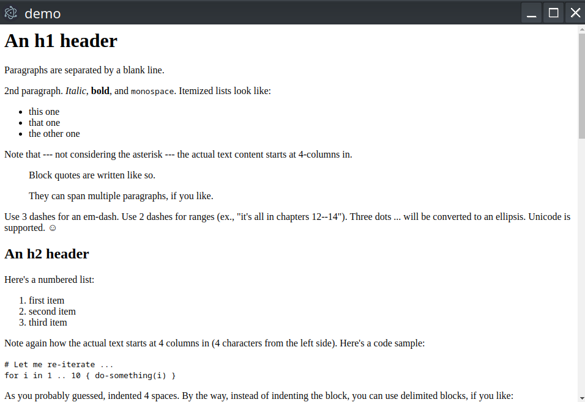
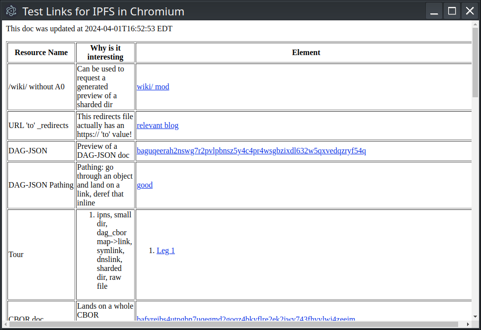

# Electron Flavor Tweaks

## The situation

Chromium is a powerful project, implementing functionality that's critical to the Web and web-related technologies. Perhaps the greatest credit to its quality and completeness is that fact that it has become an almost defacto-standard. So it's no surprise that other projects would want to inherit much of that codebase.

You can't upstream everything you'd want to do with it, as your needs are not necessarily the needs of everyone everwhere. Chromium would be a chaotic mess if everyone did this, so it's no surprise

It is also very, very active with code changes happening nearly constantly, and some of them quite important. So forking Chromium isn't attractive, since you'd want to benefit from the rest of the community.

This leaves a number of projects in the sometimes-hairy situation of being "downstream", defining their code as a series of patches, file additions, and/or file deletions on top of Chromium's code base. And of course this means a fair amount of work needs to be done to accomodate upstream changes. Electron is in this camp, and as a very active project in its own right they do an excellent job of it.

So what if someone wanted a slightly modified Electron, perhaps adding some feature(s) that are too specific to be in-scope for upstream, but make sense for their specific application? Create their own flavor of Electron? They need to ask themselves a very serious question: are they really going to maintain a project that is a set of patches on top of a rapidly-moving set of patches on top of a rapidly-moving upstream? How difficult is this? Could we make it easier?

## One approach

What if, instead of upstreaming all our niche changes, we could upstream some extension points to make this process easier?

Adding files wholesale is considerably easier than patching upstream files. We get to skip the merge conflicts, and it might be easier to test them in isolation. So for build-time extension, a build-script could change its behavior based on the presence of a particular file path. That way if you don't change anything you get the normal build behavior, but if you do /electron hooks into your code without you changing anything.

So, on the downstream side this means:
* Add a directory for your module, complete with it's own BUILD.gn
* Include a source file (header) with a pre-defined name that implements a pre-defined function signature, for each hook you want to use.

On the [upstream](https://github.com/little-bear-labs/ipfs-electron/pull/2) (electron) side, this means:
* The build script notes the presence of your BUILD.gn and adds a dependency so it can call into your code
* For each pre-defined header file name, if it exists the build script flips a build flag
* In the appropriate part of the build, if the compile-time flag is set, it includes your header and compiles a call into your function.

### What hooks

Presumably this would/could change. I haven't imagined every conceivable use case. But I did do a few demonstrations of the technique, and for them I found these sufficient:

* Immediately after `PreMainMessageLoopRun`, in case you have initialization to do
* Registering additional preferences
* Creating URL Loader Request interceptor(s)
* Creating sub-resource URL loader factories
* List of additional protocol schemes to consider "handled"

### Example Demos

So what demonstrations did I cook up, just to whet your appetite?

#### Rendering Markdown

[This](https://github.com/John-LittleBearLabs/markdown-electron) spin on Electron uses a URL Loader Request interceptor that kicks in when a user navigates (e.g. clicks a link to) a raw Markdown document. It uses [CMark](https://github.com/commonmark/cmark) to convert it to HTML, and renders that. One can also substitute `cmark-gfm` if one prefers GitHub-flavored markdown.

#### Replacing resources with static data.

[This](https://github.com/John-LittleBearLabs/jpegified_electron_spin)
electron tweak replaces uses a sub-resources URL Loader to intercept requests from ``, fetch, etc. whose URLs end in ".jpg"... and respond to them with a chunk of static data. Obviously this is a silly toy example, but replacing HTTP requests with static resources could have uses.

#### IPFS

[This](https://github.com/little-bear-labs/ipfs-chromium/pull/107/files#diff-e390c84b9e1ba2826cd2ce771bedc81b9d5a65fc95f134403fd141f864137b4b) variant of electron uses all 5 of the above hooks and fully supports `ipfs://` and `ipns://` URLs.

## Feedback

What use-case-specific functionality would you like your app to have? What do you think about this approach? Don't be afraid to join [the conversation](https://github.com/electron/electron/issues/42455).
